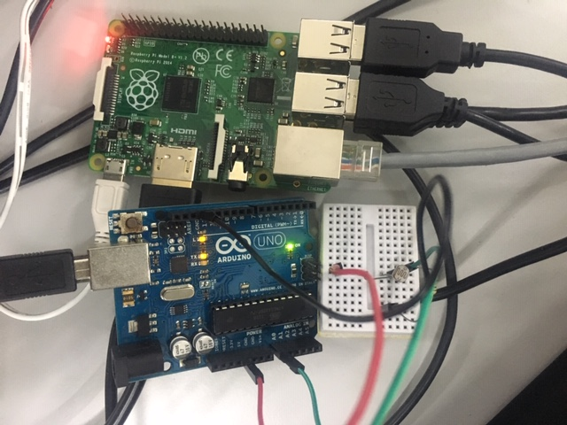
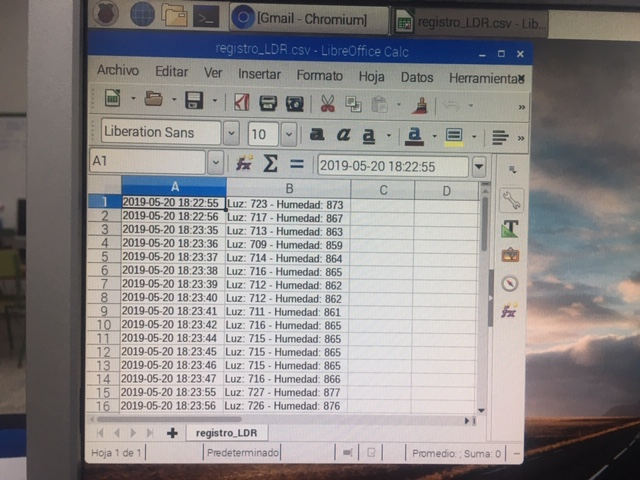

# Registro de Temperaturas y Humedad en Archivo CSV

Envio de datos de los sensores DHT11 conectados a las entradas analógicas de Arduino y enviados a la Raspberry a traves de Pyserial y guardado en un archivo csv




## Materiales

- 1 Raspberry Pi
- 1 Arduino
- 1 Cable

## Esquema eléctrico

Descripción y fórmulas del esquema eléctrico si las hubiese

```
V = 5V - 2.1V = 2.9V
I = 20mA

Fórmulas
```


## Programación

Descripción interesante sobre la programación

```python
# Programa en python
# https://techzeero.com/arduino-tutorials/dht11-with-arduino/
from time import sleep,strftime,time
import serial,time
arduino = serial.Serial('/dev/ttyACM0',9600)

while True:
  cadena = arduino.readline()
  
  if(cadena.decode() != ''):
    cadena = str(cadena.decode())
    cadena = cadena.split(',')
    print(cadena)
    if len(cadena) == 4: # si tienes 4 sensores
        humedad0 = int(cadena[0])
        temperatura0 = int(cadena[1])
        humedad1 = int(cadena[2])
        temperatura1 = int(cadena[3])
        
        imprimir = str(humedad0)+','+str(temperatura0)+','+str(humedad1)+','+str(temperatura1)
        print(imprimir)
        with open("/home/pi/Desktop/registro_temp_humedad/registro_temp_humedad_08102019_1.csv", "a") as log:#"a" es registro continuo
            log.write("{0},{1}\n".format(strftime("%Y-%m-%d %H:%M:%S"),imprimir))
  
  time.sleep(1)

arduino.close()

```

```arduino
#include <dht.h>

/* 
   DHT11 Temperature and Humidity Sensor With Arduino
   For more details, visit: https://techzeero.com/arduino-tutorials/dht11-with-arduino/
*/

#define dht_pin0 A0     // Analog Pin A0 of Arduino is connected to DHT11 out pin
#define dht_pin1 A1
dht SensorDHT_0;
dht SensorDHT_1;
 
void setup()
{
  Serial.begin(9600);
  //delay(500);
  //Serial.println("DHT11 Humidity & temperature Sensor\n\n");
  //delay(1000);
}
 
void loop()
{
    SensorDHT_0.read11(dht_pin0);
    int humedad0 = SensorDHT_0.humidity;
    int temperatura0 = SensorDHT_0.temperature;
    
    SensorDHT_1.read11(dht_pin1);
    int humedad1 = SensorDHT_1.humidity;
    int temperatura1 = SensorDHT_1.temperature;
    
    String cadena = String(humedad0) + ',' + String(temperatura0) + ',' + String(humedad1) + ',' + String(temperatura1);
    Serial.println(cadena);
    delay(1000);
    
}

```


